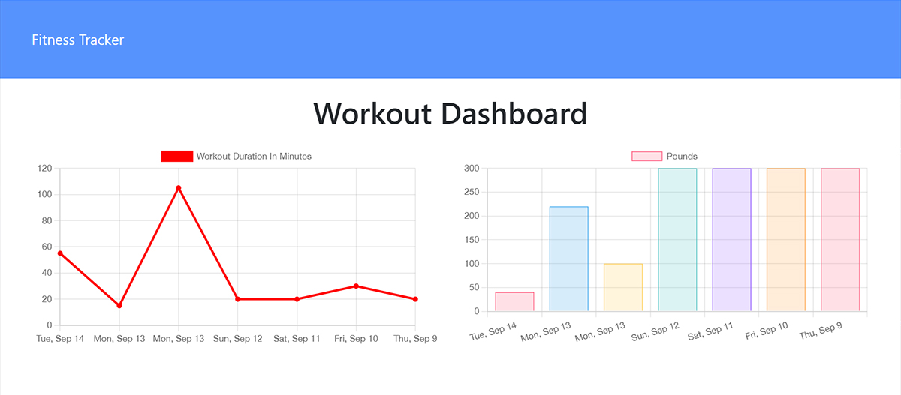

# Workout Tracker

[](https://opensource.org/licenses/MIT)

## Description

This is a full-stack web app that helps a user keep track of their workout routine and goals. By implementing a NoSQL Mongo database with a Mongoose schema, the user can submit data to a workout document and store an array of exercises into a workout. Exercises are split into resistance and cardio which collectively can keep track of name, duration, weight, reps, sets, and distance. The user can view total weight lifted and total distance traveled from the most recent seven workouts formatted on two charts available on the dashboard page. Both by keeping the user engaged with tracking their workouts and seeing progress, hopefully the user will reach their fitness goals faster and with a sense of accomplishment.

## Table of Contents

- [User Story](#user-story)
- [Live Site](#live-site)
- [Technologies](#technologies)
- [License](#license)
- [Contact](#contact)

## User Story

```
AS A fitness enthusiast 
I WANT to be able to view create and track daily workouts
SO THAT I can reach my fitness goals more quickly
```

## Live Site

https://workout-tracker-wlc.herokuapp.com/



## Technologies

- MongoDB
- Mongoose 
- Node.js
- Express.js

## License

Licensed under the MIT License - https://opensource.org/licenses/MIT

## Contact

If you have any questions you can email me at williamcrownover1@gmail.com.

You can also check out my other work on GitHub at [WilliamCrownover](https://github.com/WilliamCrownover)